# Juice-shop report
Fait par Pauline PRIEUR | 3SI1


## Table des matières


  - [Scope](#scope)
  - [Login Support Team](#login-support-team)
    - [Description](#description)
    - [Risques](#risques)
    - [Étapes à reproduire](#étapes-à-reproduire)
  - [Login Bjoern](#login-bjoern)
    - [Description](#description-1)
    - [Risques](#risques-1)
    - [Étapes à reproduire](#étapes-à-reproduire-1)
  - [Steganography](#steganography)
    - [Issue Description](#issue-description)
    - [Risques](#risques-2)
    - [Étapes à reproduire](#étapes-à-reproduire-2)


## Scope
Dans ce write-up, le scope analysé est le suivant : 
>https://juicee-loullouw.herokuapp.com/#/

## Login Support Team 


### Description

> *Log in with the support team's original user credentials without applying SQL Injection or any other bypass.*


### Risques
- Type: **`Security Misconfiguration`**
- Difficulté: ⭐⭐⭐⭐⭐⭐


### Étapes à reproduire
1. Lister tous les répertoires/fichiers de l'application 
   ```
    dirb https://juicee-loullouw.herokuapp.com
   ``` 
    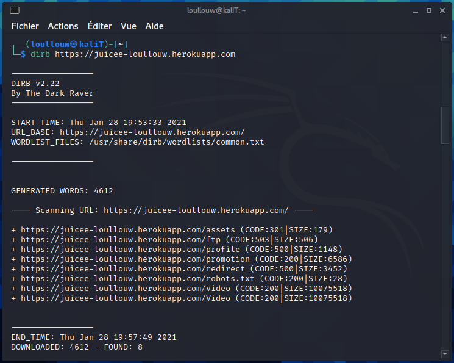
1. On y trouve un dossier `/ftp` qui contient le fichier `incident-support.kdbx` qui est une base de données Keepass 
   >https://juicee-loullouw.herokuapp.com/ftp/incident-support.kdbx
   
   *on remarquera qu'en le téléchargeant, on passe outre le filtre :*
   >403 Error: Only .md and .pdf files are allowed!
   
2. On analyse le fichier `main-es2018.js` que l'on trouve dans la section **Source** dans les Developper's Tools afin de voir s'il ne contient pas des informations qui pourraient nous aider à trouver le mot de passe de la base Keepass (en cherchant pas exemple le mot "support").  On y trouve la fonction `login()` 
   ```javascript
   login() {
        this.user = {}, this.user.email = this.emailControl.value, this.user.password = this.passwordControl.value, this.userService.login(this.user).subscribe(t => {
            localStorage.setItem("token", t.token);
            const e = new Date;
            e.setHours(e.getHours() + 8), this.cookieService.set("token", t.token, e, "/"), sessionStorage.setItem("bid", t.bid), this.basketService.updateNumberOfCartItems(), this.userService.isLoggedIn.next(!0), this.ngZone.run(async () => await this.router.navigate(["/search"]))
        }, ({
            error: t
        }) => {
            if (t.status && t.data && "totp_token_required" === t.status) return localStorage.setItem("totp_tmp_token", t.data.tmpToken), void this.ngZone.run(async () => await this.router.navigate(["/2fa/enter"]));
            localStorage.removeItem("token"), this.cookieService.delete("token", "/"), sessionStorage.removeItem("bid"), this.error = t, this.userService.isLoggedIn.next(!1), this.emailControl.markAsPristine(), this.passwordControl.markAsPristine()
        }), this.rememberMe.value ? localStorage.setItem("email", this.user.email) : localStorage.removeItem("email"), this.error && this.user.email && this.user.email.match(/support@.*/) && console.log("@echipa de suport: Secretul nostru comun este \xeenc\u0103 Caoimhe cu parola de master gol!")
    }
    ```
    On peut y voir sur la dernière ligne *(en roumain)*

	> `console.log("@echipa de suport: Secretul nostru comun este \xeenc\u0103 > Caoimhe cu parola de master gol!")`

    Ce qui donne en français :
    > Équipe de Support : Notre secret est toujours le mot de passe principal commun de Caoimhe


	
3. Quand on essaie d'ouvrir la base de données, on voit qu'on peut l'ouvrir avec un fichier

    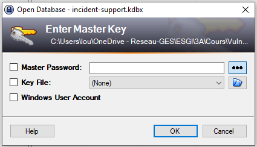

    On a découvert plus haut une référence à Caoimhe. Après quelques recherches sur internet, on apprends que c'est un prénom irlandais.

5. Allons sur le site https://juicee-loullouw.herokuapp.com/about#/about et parcourons le carrousel de photos. Il y a une femme aux cheveux roux, ce qui est un attribut (stéréo) typique des Irlandais - serais-ce "Caoimhe" ?
6. On télécharge la photo suivante : 
    >https://juicee-loullouw.herokuapp.com/assets/public/images/carousel/6.jpg 

    Pour essayer de l'utiliser comme fichier qui déverrouillera la base de données. 

    

7.  On ajoute la photo dans Keepass pour déverrouiller la base.

    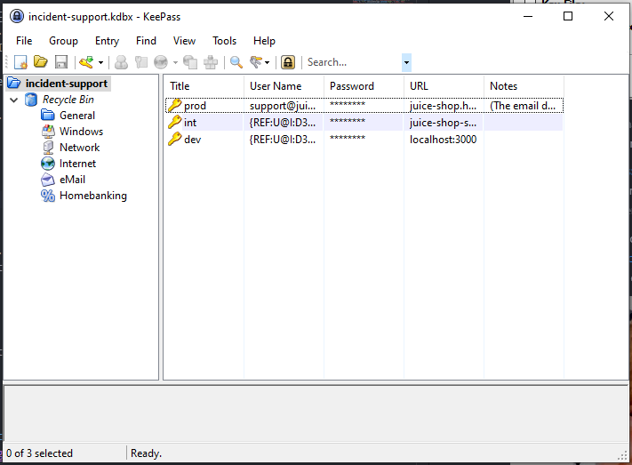
    Il suffit maintenant de *modifier* l'entrée **prod** afin de trouver le mot de passe du compte utilisateur de l'équipe de support.
8.  On se connecte avec `support@juice-sh.op` comme **Email** et `J6aVjTgOpRs$?5l+Zkq2AYnCE@RF§P` comme **Password** pour terminer le challenge. 
    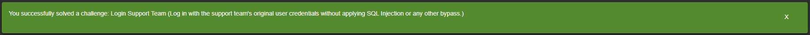


## Forged Coupon 


### Description

> *Forge a coupon code that gives you a discount of at least 80%.*

Pour ce challenge, il y a deux solutions "d'attaques" possible, j'ai ici choisi la solution de Reverse engineering

### Risques
- Type: **`Cryptographic Issues`**
- Difficulté: ⭐⭐⭐⭐⭐⭐


### Étapes à reproduire
1. Lister tous les répertoires/fichiers de l'application 
   ```
    dirb https://juicee-loullouw.herokuapp.com
   ``` 
    
1. On y trouve un dossier `/ftp` qui contient le fichier `package.json.bak` qui est un fichier de sauvegarde 
    >https://juicee-loullouw.herokuapp.com/ftp/package.json.bak

    Si on essaie de l'ouvrir, on tombe sur l'erreur suivante 


    

    Pour l'ouvrir, il faut utiliser la technique de **Poison Null Byte** qui consiste à rajouter `%00.md` à la fin de l'url et à l'encoder pour qu'il soit intrepreté en tant que null byte et non en caractère ce qui donne l'url suivante : 
    >https://juicee-loullouw.herokuapp.com/ftp/package.json.bak%2500.md 
2.  Une fois le fichier téléchargé, voilà ce qu'on peut y trouver :
    ```json
    "dependencies": {
    "hashids": "~1.1",
    "jsonwebtoken": "~8",
    "z85": "~0.0"
    }
    ```
    En réduisant les dépendances à des bibliothèques de crypto ou de hachage, on se retrouve avec `hashids`, `jsonwebtoken` et `z85`
    
    Il s'avère que le z85 *(ZeroMQ Base-85 Encoding)* a été choisi comme algorithme de création du code du coupon.
3. Si on va sur le compte [Twitter](https://twitter.com/owasp_juiceshop) de Juice Shop, on peut trouver des coupons valides 

    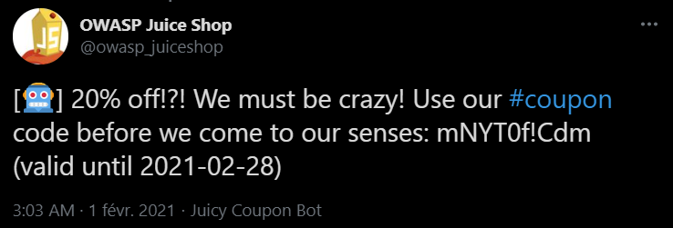

    Ici, le code est `mNYT0f!Cdm` et promettait 20% de réductions

4. Comme vu plus tôt, **z85** a été surement été choisi pour encoder le coupon. Or cette bibliothèque permet d'encoder en Base 85.

    Si ce n'est pas déjà fait, intaller Node.js puis le package [z85](https://www.npmjs.com/package/z85-cli)

    ```
        sudo apt install nodejs npm
        npm install -g z85-cli 
    ```
5. Lancer la commande suivante pour décoder le code trouvé plus haut sur Twitter
    ```
        z85 -d "mNYT0f!Cdm"
    ```


    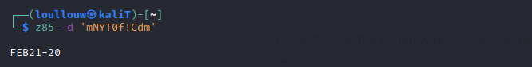
    On peut donc voir que le code est `FEB21-20`.

    On peut en déduire que si l'on veut un code de **80%** celui-ci sera `FEB21-80`. Il ne reste plus qu'à l'encoder en Base 85

    ```
        z85 -e "FEB21-80"
    ```

    
    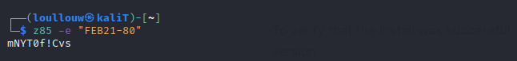
    Ce qui donne le code `mNYT0f!Cvs`

7. Il faut entrer le code généré dans le panier et procéder au paiement pour résoudre le challenge

    
    


## Login Bjoern 


### Description

> *Log in with Bjoern's Gmail account without previously changing his password, applying SQL Injection, or hacking his Google account.*


### Risques
- Type: **`Broken Authentication`**
- Difficulté: ⭐⭐⭐⭐


### Étapes à reproduire
1. Bjoern s'est inscrit via Google OAuth avec le compte google `bjoern.kimminich@gmail.com`
2.  Pour savoir comment fonctionne l'enregistrement et la connexion à OAuth, il faut regarder dans le fichier `main-es2018.js` que l'on trouve dans la section **Source** dans les Developper's Tools.

    En cherchant par exemple le mot "oauth", on y trouve la fontion `ngOnInit()`
    ```javascript
    ngOnInit() {
        this.userService.oauthLogin(this.parseRedirectUrlParams().access_token).subscribe(t => {
            const e = btoa(t.email.split("").reverse().join(""));
            this.userService.save({
                email: t.email,
                password: e,
                passwordRepeat: e
            }).subscribe(() => {
                this.login(t)
            }, () => this.login(t))
        }, t => {
            this.invalidateSession(t), this.ngZone.run(async () => await this.router.navigate(["/login"]))
        })
    }
    ```
    
4.	Dans la fonction, on peut voir un appel à `userService.save()`  qui est utilisé pour *"convertir"* un compte google en compte utilisateur.

5.	La constante `e` indique comment est créée le mot de passe du compte
    ```javascript
    e = btoa(n.email.split("").reverse().join(""))
    ```

    En javascript, la fonction `btoa` permet d'encoder des chaînes de caractères en Base64.

    La suite d'instruction `email.split("").reverse().join("")` permet quant à elle d'inverser l'email.

6. Il ne reste plus qu'a inverser l'adresse email `bjoern.kimminich@gmail.com` ce qui donne `moc.liamg@hcinimmik.nreojb` puis à l'encoder en Base64 pour obtenir le mot de passe du compte `bW9jLmxpYW1nQGhjaW5pbW1pay5ucmVvamI=`

8.	Il suffit ensuite de se connecter directement avec l'adresse email bjoern.kimminich@gmail.com et le mot de passe `bW9jLmxpYW1nQGhjaW5pbW1pay5ucmVvamI=`.

    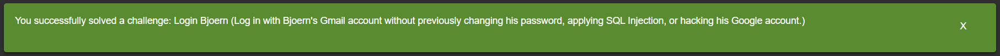


## Steganography 


### Issue Description

> *Rat out a notorious character hiding in plain sight in the shop. (Mention the exact name of the character)*

### Risques
- Type: **`Security through Obscurity`**
- Difficulté: ⭐⭐⭐⭐


### Étapes à reproduire
1. En recherchant des irrégularités parmi les fichiers d'images, on remarque à un moment donné que `5.png` est le seul fichier *PNG* parmi les autres images du caroussel. 

    

2. Après avoir téléchargé l'image, j'ai essayé en vain de l'analyser via des décodeurs en lignes qui ne m'ont rien renvoyé de satisfaisant. Je suis donc passé via OpenStego* qui est un client de bureau

    **Il nécessite l'installation de JAVA sur la machine*

    

3. On ajoute le fichier `5.png` dans le logiciel et on extrait les données.

    Celui-ci nous retourne le message suivant 

    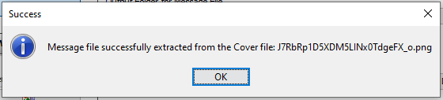

    Il suffit ensuite de se rendre dans le dossier où l'image à été extraite pour y trouver l'image cachée.

    

    L'image récupéré montre **Pickle Rick** un personnage du dessin animé Rick et Morty

4. La dernière étape consiste à envoyer un message au support via le [Customer Feedback](https://juicee-loullouw.herokuapp.com/#/contact) en mettant comme commentaire `pickle rick` pour valider le challenge.

    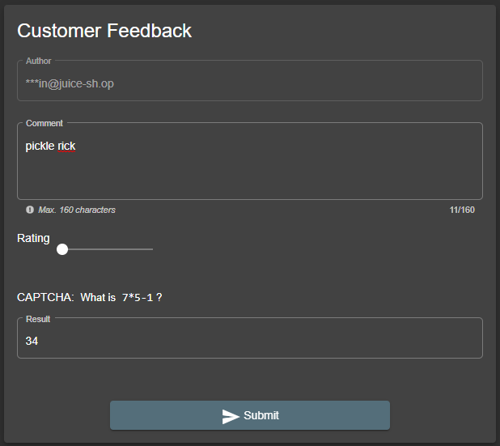
    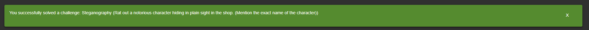
